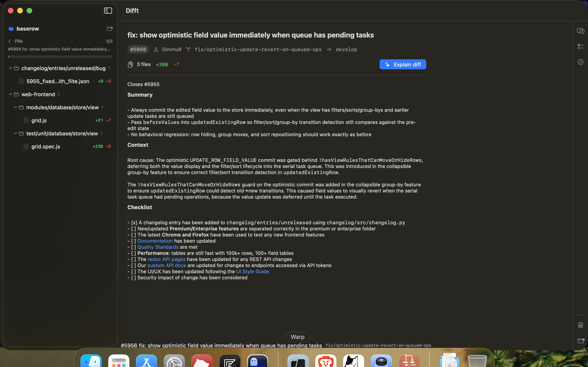
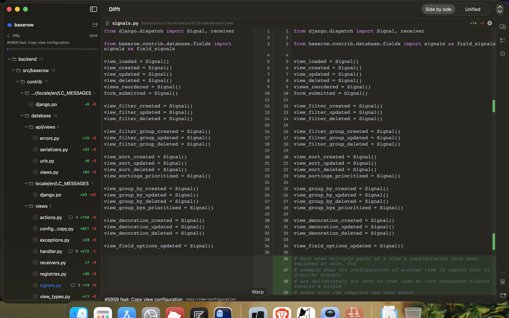
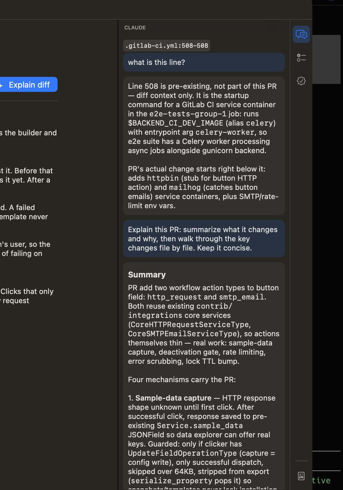

# Difft

A native macOS app for reviewing GitHub pull requests, with Claude built in.

Difft shows every changed file in full — the whole file, changes highlighted inline, line numbers meeting at a draggable center gutter, the way JetBrains renders diffs. Review comments from GitHub appear as cards anchored to their lines, and Claude sits in a side panel where it can explain the diff, answer questions about a selection, run a full review, or drive a browser to verify the change actually works.



## What it does

**Diff viewer** — pure SwiftUI, no web view. Side-by-side or unified layout, full-file context with syntax highlighting (Highlightr, theme follows system appearance), word-level change emphasis, a change-overview rail for jumping between edits in long files, wrapping long lines, and a draggable split between old and new. Click a line to select it, drag or shift-click for a range, right-click to copy or ask Claude about it.

**PR navigation** — pull requests load through the `gh` CLI (no OAuth, no tokens to manage). Filter the list by title, number, or author. Opening a PR lands on an overview page with the description rendered as markdown and an **Explain diff** button. Changed files show as a collapsible tree with per-folder counts, viewed-checkboxes, and comment badges.

**Review comments** — inline comments from GitHub render under the exact line they anchor to, threads and all, with fenced code blocks syntax-highlighted. Reply and resolve without leaving the app.



**Claude assistant** — three tools in the side panel, all running your local `claude` CLI inside a dedicated git worktree of the PR:

- **Chat** answers questions about the PR, with read-only file access so it can explore the code. Attach a line selection as context via right-click.
- **Findings** runs a full review and lists what it found — severity, file and line, explanation. Click a finding to jump to that line in the diff.
- **Verify** lets the agent start the app and drive a browser to check that the PR does what it claims, collecting screenshots as evidence. This mode runs the PR's code with permission checks disabled, so it is gated behind an explicit confirmation naming the PR — every run, no remembering.



**Reports** — one click writes a self-contained HTML file (findings, Q&A transcript, verification evidence, review status, the full diff) to `~/Documents/Difft-reports/` and opens it in the browser. No external resources, safe to share.

## Requirements

- macOS 14+
- [`gh`](https://cli.github.com) — installed and authenticated (`gh auth status`)
- [`claude`](https://docs.anthropic.com/en/docs/claude-code) — the Claude Code CLI
- A local clone of the repository whose PRs you want to review

The app checks all three at launch and tells you what's missing.

## Install

```sh
git clone git@github.com:alamin-br/difft.git
cd difft
scripts/package.sh
cp -R dist/Difft.app /Applications/
```

Point it at your repo clone with the folder button in the sidebar, and pick a PR.

## Development

Swift Package, four targets: `DifftCore` (diff model, parser, pairing, selection — pure logic, fully tested), `DifftServices` (gh/git/claude subprocesses, sessions, report builder), `DifftUI` (the diff renderer), `Difft` (the app).

```sh
swift test        # 74 tests, no network or CLI needed — subprocesses are faked
swift run Difft   # dev build
```

Sessions (viewed files, chat, findings, verdicts) persist in `~/Library/Application Support/Difft/`, worktrees under the same directory, and survive relaunches.

## How the agent runs

Chat and review invoke `claude -p` with a read-only tool allowlist (`Read`, `Grep`, `Glob`) inside the PR's worktree — the agent can look at anything, change nothing. Verification is the only mode with full tool access, which is why it demands a per-run confirmation that spells out what you're agreeing to. Cancel any run from the panel; the subprocess gets terminated, state returns to idle.
