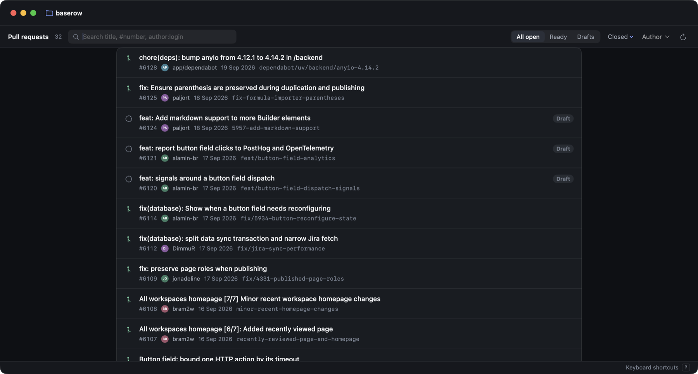

# Difft

A native macOS app for reviewing GitHub pull requests.

Three lines of context rarely tell you whether a change is correct. Difft shows every changed file end to end, with the review conversation anchored where it happened, the branch's commits, and the diff any single commit introduced.


## Install

```sh
brew tap alaminopu/difft https://github.com/alaminopu/difft
brew trust --cask alaminopu/difft/difft
brew install --cask difft
xattr -dr com.apple.quarantine /Applications/Difft.app
```

Or [download the latest release](https://github.com/alaminopu/difft/releases/latest) and drag it to Applications, then run that last line.

Difft is ad-hoc signed rather than notarized, so macOS quarantines it however you get it and Gatekeeper refuses to open it until that flag is cleared. Homebrew requires `brew trust` for third-party casks and no longer offers `--no-quarantine`, so both steps are explicit.

**Requires** macOS 14+, [`gh`](https://cli.github.com) authenticated, and a local clone of the repo you want to review. Difft checks at launch and says what is missing.

Open your clone from the home page (or drop the folder on the window), and pick a PR. Recent repositories stay on the home page and in the repository menu.



A PR opens on its overview. The tabs across the top are the whole review: **Overview**, **Files**, **Threads**, **Findings**, **Commits**, **Walkthrough** (⌘1–⌘6), each showing what is waiting in it.


## Finding your way around a big PR

The sidebar is only files: a progress bar, a filter, and a tree whose folders say how many files are left in them and fold up once they are all viewed. The options button hides viewed files or flattens the tree. **⌘K** jumps to any file by a few letters of its name — `name:120` lands on a line — and **J**/**K** step through them in order. **V** marks the open file viewed and moves to the next one.

On the right, the **review queue** lists what stands between you and submitting: open threads, findings nobody has dismissed, files not yet viewed — the ones in the file you are reading first. Each opens the line it is about. *Finish review* sits under it.

## Diff

Pure SwiftUI, no web view. Split or unified, full-file context with the unchanged runs folded away, word-level emphasis on what actually changed, and a rail for jumping between edits in long files (**N**/**P** step through them). Click a line to select it, drag or shift-click for a range, then **C** to comment, **A** to ask about it, or right-click for those plus copying the code or a `path:line` reference.

## Comments


A thread renders as one card under the line it belongs to, markdown and code blocks intact — and the HTML that review bots write (badges, `<details>` folds, `<code>`) is turned into readable text rather than shown as angle brackets. Resolved threads fold to a line. Reply, resolve, or edit your own; select lines and press **C** to start a new one. Even a commit mentioned in passing — "fixed in d59f520cc" — opens its diff here rather than in a browser.

The **Threads** tab (⇧⌘C) lists every thread grouped by file, filtered by resolved state and searchable across bodies, authors and paths. Each shows the hunk it anchors to, and jumps to the line.


## Commits

The **Commits** tab (⇧⌘K) lists commits newest first, grouped by day. Click one for the diff it introduced against its parent.


## Explain diff

**⇧⌘E** opens a walkthrough of the PR in its own pane. Not a summary of the diff — you already have the diff. It answers what the change is *for*, groups it into a handful of areas by behaviour rather than reciting it file by file, and says where the risk sits.

It separates the load-bearing changes from the mechanical bulk, marks whether the author's intent was *stated* or reconstructed from the code, and ends with a short comprehension gate — a few questions you should be able to answer before approving. Every file and line it names is a link into the diff. It runs read-only in the PR's worktree, and the result is kept with the session: reopening the PR shows it instantly, and it tells you when the branch has moved on since.

## Review

**⇧⌘F** reviews the PR in two passes. The first reads the changed files, their callers, and any `CLAUDE.md` or `AGENTS.md` that governs them. The second tries to *disprove* every candidate and throws out what it cannot show is real — the header says how many were rejected, because that number is the evidence the filter did something.

Findings are grouped by file, worst first, filterable by severity, and each one has to name the concrete inputs that produce the wrong result. They also appear inline in the diff, on the line they're about. Dismiss the ones you disagree with; the dismissal sticks.

## Your review

Notes are staged as you read and submitted together with a verdict from **Your review** (⇧⌘Y, or *Finish review* under the queue) — one notification for the author instead of one per note. A verdict can be submitted on its own, so approving a clean PR takes no comment.

## Ask

The side panel's other face runs your local agent CLI inside a dedicated git worktree of the PR and answers questions with read-only access to the code. Select lines and press **A** to ask about them.

Ask and the review run read-only. Asking one to fix a finding lets it edit files, but only inside that disposable worktree — never your checkout.

## Settings

⌘, has four tabs, each previewed on a real diff: **Appearance** (light, dark or system; syntax colours), **Diff** (code font, size, line spacing, split or unified), **Review** (whether marking a file viewed moves on, the queue, the file list, notifications) and **Shortcuts**.

The code font defaults to JetBrains Mono without ligatures, bundled with the app — a review tool should show the characters that were typed, and a font that draws `!=` as one glyph does not. SF Mono and any installed monospaced font are a menu away. The font is pushed into the highlighter rather than applied around it, so it reaches the highlighted code.

Right-click works throughout: pull requests, files and folders, threads, findings, commits, queue items, staged notes and diff lines all have the menu you would expect.

## Shortcuts

| | |
| --- | --- |
| `⌘1` – `⌘6` | Overview · Files · Threads · Findings · Commits · Walkthrough |
| `⌘K` | Jump to a file, a line, or a tab |
| `J` `K` · `N` `P` | Next, previous file · next, previous change |
| `V` | Mark the file viewed and move on |
| `C` · `A` | Comment on · ask about the selected lines |
| `⇧⌘E` `⇧⌘F` | Run or open the walkthrough · the review |
| `⇧⌘Y` `⌘↩` | Your review · add the comment to it |
| `⌃⌘S` `⌥⌘0` | File list · review queue |
| `⌘O` `⌘R` `⌘,` | Open repository · refresh · settings |

Single-letter keys act on the diff, so click in it once first. The full list is behind **Keyboard shortcuts** in the status bar.

## Development

```sh
swift test        # 267 tests, no network or CLI needed
swift run Difft   # dev build
scripts/release.sh 0.2.0

# A debug build can be driven straight to a screen, for checking a UI change:
DIFFT_OPEN_PR=1135 DIFFT_OPEN_PATH=form/main.py DIFFT_OPEN_LINE=120 swift run Difft
```

Four targets: `DifftCore` (diff model and parsing, pure logic), `DifftServices` (subprocesses, sessions, GitHub), `DifftUI` (the renderer), `Difft` (the app).

State lives in `~/Library/Application Support/Difft/` — viewed files, chat, findings, and the PR worktrees — and survives relaunches.
