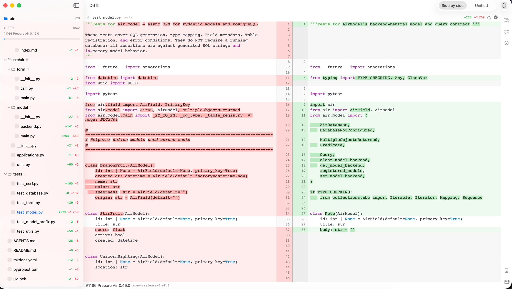

# Difft

A native macOS app for reviewing GitHub pull requests.

Difft shows every changed file in full — not just the changed hunks. Changes are highlighted inline, line numbers meet at a draggable center gutter, and review comments appear as cards anchored to the exact line they belong to. Alongside the diff you get every review thread in one list, the branch's commits, and the diff any single commit introduced.



## Features

### Diff viewer

Pure SwiftUI — no web view.

- Side-by-side or unified layout
- Full-file context, not just hunks
- Syntax highlighting that follows your Light or Dark choice
- Word-level emphasis on what actually changed
- A change-overview rail for jumping between edits in long files
- Draggable split between the old and new sides
- Click a line to select it, drag or shift-click for a range, right-click to copy

### Pull requests

PRs load through the `gh` CLI, so there is no OAuth flow and no tokens to manage.

- Filter the list by title, number, or author
- The overview page renders the PR description as markdown
- Changed files show as a collapsible tree with per-folder counts
- Viewed checkboxes, and a badge per file showing its review threads

### Review comments

Inline comments from GitHub render under the line they anchor to, threads and all, with code blocks syntax-highlighted. Reply and resolve without leaving the app.

**All comments in one place** (⇧⌘C) answers the question you have before you know which file to open: what has been said at all. Every thread, grouped by file.

- Filter by all, unresolved, or resolved
- Search across comment bodies, authors, and paths
- Replies fold into their thread instead of scattering
- Each thread shows the diff hunk it anchors to, so you get the code without leaving the list
- Jump straight from a thread to its line in the diff
- Comments GitHub can no longer anchor, because the diff moved past them, are marked outdated rather than dropped

### Commits

**All commits** (⇧⌘K) lists the PR's commits newest first, grouped by the day they were authored. Search by message, author, or sha prefix, and expand any commit to read its full message.

Click a commit to see the diff it introduced against its own parent — the same full-file context as the PR diff, with its own list of changed files. Review comments are left out there on purpose: they anchor to lines in the PR head, so on an earlier commit they would point at the wrong code.

### Appearance

Light, Dark, or Match System, from **View → Appearance**. The choice persists across launches, and the syntax palette follows it.

### Assistant

A side panel with three tools, each running inside a dedicated git worktree of the PR:

| Tool | What it does |
| --- | --- |
| **Chat** | Answers questions about the PR, with read-only access to the code. Attach a line selection as context by right-clicking it. |
| **Findings** | Runs a full review and lists what it found — severity, file, line, explanation. Click a finding to jump to that line in the diff. |
| **Verify** | Starts the app and drives a browser to check that the PR does what it claims, collecting screenshots as evidence. |

Chat and Findings are read-only. They can look at anything and change nothing.

Verify is the exception: it runs the PR's code with permission checks disabled, so it is gated behind an explicit confirmation that names the PR — every run, no remembering.

Cancel any run from the panel. The subprocess is terminated and state returns to idle.

### Reports

One click writes a self-contained HTML file to `~/Documents/Difft-reports/` and opens it in your browser. It holds the findings, the question-and-answer transcript, verification evidence, review status, and the full diff. No external resources, so it is safe to share.

## Keyboard shortcuts

| Keys | Action |
| --- | --- |
| `⇧⌘C` | All review comments |
| `⇧⌘K` | All commits |
| `⌘0` | Back to the PR overview |
| `⌘R` | Refresh the PR |
| `⌥⌘0` | Show or hide the assistant panel |
| `j` / `k` | Next / previous file in the diff |

## Requirements

- macOS 14 or later
- [`gh`](https://cli.github.com), installed and authenticated — check with `gh auth status`
- A local clone of the repository whose PRs you want to review

Difft checks these at launch and tells you what is missing.

## Install

```sh
git clone git@github.com:alaminopu/difft.git
cd difft
scripts/package.sh
cp -R dist/Difft.app /Applications/
```

Open the app, point it at your repo clone with the folder button in the sidebar, and pick a PR.

## Development

Difft is a Swift package with four targets:

| Target | Contents |
| --- | --- |
| `DifftCore` | Diff model, parser, row pairing, selection — pure logic, fully tested |
| `DifftServices` | Subprocesses, sessions, report builder |
| `DifftUI` | The diff renderer |
| `Difft` | The app |

```sh
swift test        # 94 tests — no network or CLI needed, subprocesses are faked
swift run Difft   # dev build
```

State lives in `~/Library/Application Support/Difft/` — viewed files, chat history, findings, verdicts, and the PR worktrees. All of it survives relaunches.
