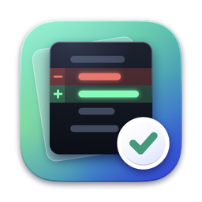

<h1 align="center">
  <br>
  Difft
</h1>

<p align="center">A native macOS app for reviewing GitHub pull requests.</p>

Three lines of context rarely tell you whether a change is correct. Difft shows every changed file in full, with the review conversation on the lines it is about, and keeps track of what you still have to look at.


## Install

```sh
brew tap alaminopu/difft https://github.com/alaminopu/difft
brew trust --cask alaminopu/difft/difft
brew install --cask difft
xattr -dr com.apple.quarantine /Applications/Difft.app
```

Or [download the latest release](https://github.com/alaminopu/difft/releases/latest), unzip it, drag Difft to Applications, and run the last line.

To upgrade:

```sh
brew update && brew upgrade --cask difft
xattr -dr com.apple.quarantine /Applications/Difft.app
```

Why the `xattr` line: Difft is signed with the author's Apple Development certificate and runs under the hardened runtime, but it is not notarized, which takes a paid Developer ID. macOS quarantines anything downloaded that is not notarized, and that line clears the flag. It is needed after every install and upgrade. You can check what you are clearing it for:

```sh
codesign -dvv /Applications/Difft.app   # TeamIdentifier=4477488F8N
```

**Requires** macOS 14+, [`gh`](https://cli.github.com) signed in, and a local clone of the repository. Difft checks at launch and says what is missing.

## Pick a pull request

Open your clone from the home page, or drop the folder on the window. The list shows who opened each PR, its branch, and whether you have already started reviewing it.


## Review it

A PR opens on its overview. The tabs across the top are the whole review: Overview, Files, Threads, Findings, Commits and Walkthrough, each with a live count.


**Files.** The sidebar lists only files: a progress bar, a filter, and folders that say how many files are left. `⌘K` jumps to any file by a few letters of its name, and `name:120` lands on a line.

**Diff.** Pure SwiftUI, no web view. Split or unified, full-file context with unchanged runs folded away, word-level emphasis, and a rail for jumping between changes. Select lines, then press `C` to comment or `A` to ask about them.

**Review queue.** The panel on the right lists what is left: open threads, findings and unviewed files, starting with the file you are reading. Each item opens the line it is about.

## Comments

Threads sit under the line they belong to, with markdown and code blocks intact. HTML from review bots is rendered as readable text. Reply, resolve, or edit your own.


The Threads tab lists every conversation grouped by file, with the hunk it refers to. Filter by resolved state or search.


## Commits

Commits are listed newest first, grouped by day. Click one to see the diff it introduced.


## Submit your review

Notes are staged as you read and sent together with a verdict from *Finish review*, so the author gets one notification instead of one per note. You can also approve with no notes at all.

## Claude

Difft runs your local `claude` CLI inside a disposable git worktree of the PR. It never touches your checkout.

- **Walkthrough** explains what the PR is for, groups the change by behaviour, and says where the risk is. Every file and line it names links into the diff.
- **Findings** reviews the PR in two passes. The second pass tries to disprove each finding and discards what it cannot show is real. Findings appear on their lines in the diff.
- **Ask** answers questions about the code, read-only.

Asking Claude to fix a finding lets it edit files, but only inside the worktree.

## Settings

`⌘,` has four tabs, each previewed on a real diff: Appearance, Diff, Review and Shortcuts.

The default code font is JetBrains Mono without ligatures, bundled with the app. A review tool should show the characters that were typed. SF Mono and any installed monospaced font are also available.

## Shortcuts

| | |
| --- | --- |
| `⌘1` to `⌘6` | Overview, Files, Threads, Findings, Commits, Walkthrough |
| `⌘K` | Jump to a file, a line, or a tab |
| `J` `K` | Next and previous file |
| `N` `P` | Next and previous change |
| `V` | Mark the file viewed and move on |
| `C` `A` | Comment on, or ask about, the selected lines |
| `⇧⌘E` `⇧⌘F` | Run or open the walkthrough, the findings |
| `⇧⌘Y` `⌘↩` | Your review, add the comment to it |
| `⌃⌘S` `⌥⌘0` | File list, review queue |
| `⌘O` `⌘R` `⌘,` | Open repository, refresh, settings |

Single-letter keys act on the diff, so click in it once first. Right-click works on pull requests, files, threads, findings, commits and diff lines.

## Development

```sh
swift test                 # no network or CLI needed
swift run Difft            # dev build
scripts/package.sh         # dist/Difft.app, signed
scripts/release.sh 0.4.2   # the same, zipped for a release
```

Packaging signs with the first Developer ID or Apple Development identity in your keychain, and ad-hoc when there is none. `DIFFT_SIGN_IDENTITY` picks one, or `-` forces ad-hoc. A build you package yourself is never quarantined, so `cp -R dist/Difft.app /Applications/` is all it needs.

Four targets: `DifftCore` (diff model and parsing), `DifftServices` (subprocesses, sessions, GitHub), `DifftUI` (the renderer), `Difft` (the app).

A debug build can open straight to a screen, which helps when checking a UI change:

```sh
DIFFT_OPEN_PR=1135 DIFFT_OPEN_PATH=form/main.py DIFFT_OPEN_LINE=120 swift run Difft
```

State lives in `~/Library/Application Support/Difft/` and survives relaunches.

## License

[MIT](LICENSE). The bundled [Highlightr](Vendor/Highlightr/LICENSE) and highlight.js keep their own licenses, and JetBrains Mono is under the [OFL](Sources/DifftUI/Resources/Fonts/OFL.txt).
