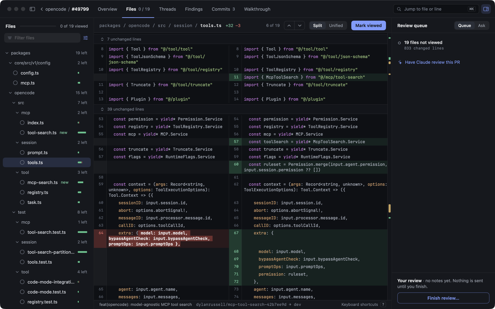
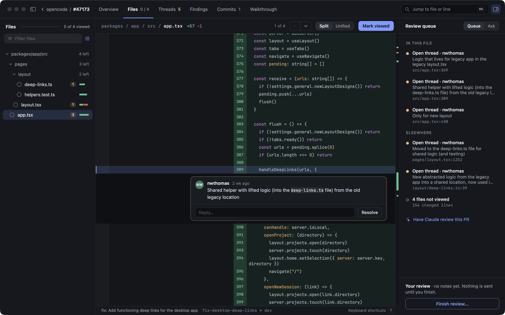
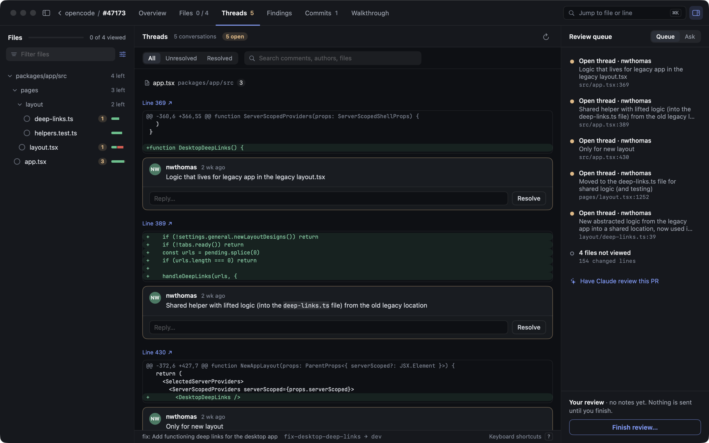
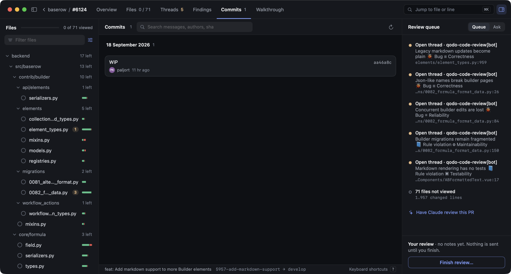

# Difft

A native macOS app for reviewing GitHub pull requests.

Three lines of context rarely tell you whether a change is correct. Difft shows every changed file end to end, with the review conversation anchored where it happened, the branch's commits, and the diff any single commit introduced.



## Install

```sh
brew tap alaminopu/difft https://github.com/alaminopu/difft
brew trust --cask alaminopu/difft/difft
brew install --cask difft
xattr -dr com.apple.quarantine /Applications/Difft.app
```

Or [download the latest release](https://github.com/alaminopu/difft/releases/latest) and drag it to Applications, then run that last line.

Difft is ad-hoc signed rather than notarized, so macOS quarantines it however you get it and Gatekeeper refuses to open it until that flag is cleared. Homebrew requires `brew trust` for third-party casks and no longer offers `--no-quarantine`, so both steps are explicit.

**Requires** macOS 14+, [`gh`](https://cli.github.com) authenticated, and a local clone of the repo you want to review. Difft checks at launch and says what is missing.

Point it at your clone with the folder button, and pick a PR.


## Diff

Pure SwiftUI, no web view. Side-by-side or unified, full-file context, word-level emphasis on what actually changed, and a rail for jumping between edits in long files. Click a line to select it, drag or shift-click for a range, right-click to copy, comment, or ask about it.

## Comments



Threads render under the line they belong to, markdown and code blocks intact. Reply, resolve, or edit your own; select lines and right-click to start a new one. Even a commit mentioned in passing — "fixed in d59f520cc" — opens its diff here rather than in a browser.

**⇧⌘C** lists every thread grouped by file, filtered by resolved state and searchable across bodies, authors and paths. Each shows the hunk it anchors to, and jumps to the line.



## Commits

**⇧⌘K** lists commits newest first, grouped by day. Click one for the diff it introduced against its parent.



## Explain diff

**⇧⌘E** opens a walkthrough of the PR in its own pane. Not a summary of the diff — you already have the diff. It answers what the change is *for*, groups it into a handful of areas by behaviour rather than reciting it file by file, and says where the risk sits.

It separates the load-bearing changes from the mechanical bulk, marks whether the author's intent was *stated* or reconstructed from the code, and ends with a short comprehension gate — a few questions you should be able to answer before approving. Every file and line it names is a link into the diff. It runs read-only in the PR's worktree, and the result is kept with the session: reopening the PR shows it instantly, and it tells you when the branch has moved on since.

## Review

**⇧⌘F** reviews the PR in two passes. The first reads the changed files, their callers, and any `CLAUDE.md` or `AGENTS.md` that governs them. The second tries to *disprove* every candidate and throws out what it cannot show is real — the header says how many were rejected, because that number is the evidence the filter did something.

Findings are grouped by file, worst first, filterable by severity, and each one has to name the concrete inputs that produce the wrong result. They also appear inline in the diff, on the line they're about. Dismiss the ones you disagree with; the dismissal sticks.

## Assistant

A side panel running your local agent CLI inside a dedicated git worktree of the PR. **Chat** answers questions with read-only access to the code. **Findings** shows the score and opens the review pane.

Chat and Findings run read-only. Asking one to fix a finding lets it edit files, but only inside that disposable worktree — never your checkout.

**Reports** write a self-contained HTML file to `~/Documents/Difft-reports/` — findings, transcript, and the full diff, with no external resources.

## Settings

⌘, sets appearance, syntax colours, and the code font and size. The font is pushed into the highlighter rather than applied around it, so it reaches the highlighted code.

## Shortcuts

| | |
| --- | --- |
| `⇧⌘C` `⇧⌘K` | Comments · Commits |
| `⇧⌘E` `⇧⌘F` | Explain diff · Review findings |
| `⌘0` `⌘R` | Overview · Refresh |
| `⌥⌘0` | Assistant panel |
| `⌘,` `⌘↩` | Settings · Post comment |
| `j` `k` | Next · previous file |

## Development

```sh
swift test        # 170 tests, no network or CLI needed
swift run Difft   # dev build
scripts/release.sh 0.1.1
```

Four targets: `DifftCore` (diff model and parsing, pure logic), `DifftServices` (subprocesses, sessions, reports), `DifftUI` (the renderer), `Difft` (the app).

State lives in `~/Library/Application Support/Difft/` — viewed files, chat, findings, and the PR worktrees — and survives relaunches.
